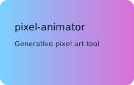
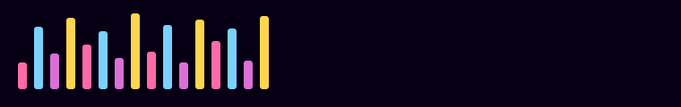

# Hi — I'm okonakona 👋

  

  <!-- flashy "gacha" style badges -->
  
  
  

---

## Visual Hero

  <!-- hero SVG (replace with your own animated demo or convert to GIF if you prefer) -->
  

---

## Highlights & Metrics

  
  

---

## Showcase 

  <!-- small "card" gallery; replace images with your project card SVGs -->
  
  
  

---

## スキル

  
  
  
  
  
  
  
  

---

## Activity

  

---

## Featured Projects
- [メイクシミュレーション](https://github.com/okonakona/standout) — 男性のメイクアップを手助けするwebアプリ
- [カレンダー作成](https://github.com/okonakona/webt_time) — apiを使用した今日はなんの日カレンダー

---

  <em>✨ — thanks for stopping by!</em>

